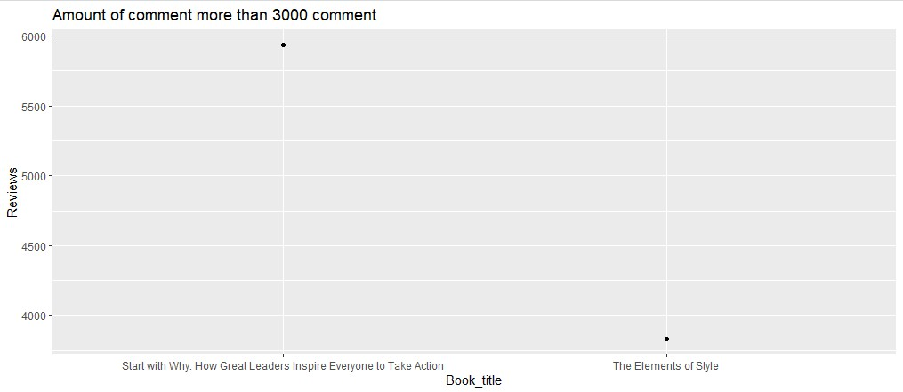
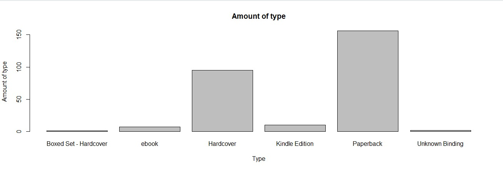

# R-Assignment 4

**Created by Wareewan Pongpunchaikul (ID: 63130500105)**

Choose Dataset:
1. Top 270 Computer Science / Programing Books (Data from Thomas Konstantin, [Kaggle](https://www.kaggle.com/thomaskonstantin/top-270-rated-computer-science-programing-books)) >> [Using CSV](https://raw.githubusercontent.com/safesit23/INT214-Statistics/main/datasets/prog_book.csv)

### Outlines
1. Explore the dataset
2. Learning function from Tidyverse
3. Transform data with dplyr and finding insight the data
4. Visualization with GGplot2

## Part 1: Explore the dataset

```
# Library
library(janitor)
library(dplyr)
library(stringr)
library(tidyr)
library(assertive)
library(readr)
library(psych)
library(data.table)

# Dataset
com_book  <- read.csv("C:\\Users\\user\\Desktop\\int214\\assignment\\prog_book.csv")
```
In this dataset has 
```
Rows: 271
Columns: 7
$ Rating          <dbl> 4.17, 4.01, 3.33, 3.97, 4.06, 3.84, 4.09, 4.15, 3.87, 4.62, 4.03, 3.78, 3.73, 3.87, 3.87, 3.95, 3.85, 3.94, 3.75, 4.10, 4.22, 3.7~
$ Reviews         <dbl> 3829, 1406, 0, 1658, 1325, 117, 5938, 1817, 2093, 0, 160, 481, 33, 1255, 593, 417, 80, 279, 370, 2092, 27, 676, 16, 1268, 0, 19, ~
$ Book_title      <chr> "The Elements of Style", "The Information: A History, a Theory, a Flood", "Responsive Web Design Overview For Beginners", "Ghost ~
$ Description     <chr> "This style manual offers practical advice on improving writing skills. Throughout, the emphasis is on promoting a plain English ~
$ Number_Of_Pages <dbl> 105, 527, 50, 393, 305, 288, 256, 368, 259, 128, 352, 352, 200, 328, 240, 288, 392, 304, 336, 542, 192, 242, 224, 412, 318, 432, ~
$ Type            <chr> "Hardcover", "Hardcover", "Kindle Edition", "Hardcover", "Kindle Edition", "Paperback", "Hardcover", "Hardcover", "Hardcover", "P~
$ Price           <dbl> 9.323529, 11.000000, 11.267647, 12.873529, 13.164706, 14.188235, 14.232353, 14.364706, 14.502941, 14.641176, 15.229412, 15.229412~
```
This dataset contains 271 rows and consists of 7 columns. The dataset contains information related to Computer Science / Programing Books, 
which includes the following topics: Rating , Reviews , Book_title , Description , Number_Of_Pages,Type and Price.

## Part 2: Learning function from Tidyverse & Part 3: Transform data with dplyr and finding insight the data
#### 1. ค่าเฉลี่ยของจำนวนหน้าของหนังสือ และ หนังสือที่มีจำนวนหน้ามากที่สุดคือหนังสืออะไร และมีจำนวนกี่หน้า

```
mean(com_book$Number_Of_Pages)
com_book%>%select(Book_title,Number_Of_Pages)%>%filter(com_book$Number_Of_Pages==max(com_book$Number_Of_Pages))

```
#### Result:
```
mean(com_book$Number_Of_Pages)
475.0775
Book_title                                                 Number_Of_Pages
  <chr>                                                             <dbl>
1 The Art of Computer Programming, Volumes 1-4a Boxed Set            3168
```
#### 2. หนังสือเล่มไหนบ้างที่มีจำนวนคนReviews มากกว่า1000comment และมีจำนวนกี่เล่ม

```
morethan1000comment %>% head()
morethan1000comment <- com_book%>%select(Book_title,Reviews)%>%filter(com_book$Reviews>1000)
count(morethan1000comment)%>% rename(amount = n)
```
#### Result:
```
มีจำนวนกี่เล่ม
amount
   <int>
1     13

หนังสือเล่มไหนบ้างที่มีจำนวนคนReviews มากกว่า1000comment
Book_title                                                          Reviews
  <chr>                                                                 <dbl>
1 The Elements of Style                                                  3829
2 The Information: A History, a Theory, a Flood                          1406
3 Ghost in the Wires: My Adventures as the World's Most Wanted Hacker    1658
4 How Google Works                                                       1325
5 Start with Why: How Great Leaders Inspire Everyone to Take Action      5938
6 Algorithms to Live By: The Computer Science of Human Decisions         1817

```

#### 3. หนังสือทั้งหมดมีกี่ประเภทมีอะไรบ้าง และ แต่ละประเภทมีหนังสือมีจำนวนเท่าไหร่
```
count(com_book %>%distinct(Type))%>%rename(amount = n)
com_book %>%distinct(Type)

book_type <- com_book %>%count(com_book$Type)%>% rename(amount = n)
book_type
```
#### Result:
```
มีกี่ประเภท
 amount
   <int>
1      6                                                                  
มีประเภทอะไรบ้าง
  Type                 
  <chr>                
1 Hardcover            
2 Kindle Edition       
3 Paperback            
4 ebook                
5 Unknown Binding      
6 Boxed Set - Hardcover

แต่ละประเภทมีหนังสือมีจำนวน
`com_book$Type`       amount
  <chr>                  <int>
1 Boxed Set - Hardcover      1
2 ebook                      7
3 Hardcover                 95
4 Kindle Edition            10
5 Paperback                156
6 Unknown Binding            2
```

#### 4. เรตติ้งที่มีค่าเฉลี่ยเท่าไหร่ และ เรตติ้งที่ต่ำกว่าค่าเฉลี่ยมีจำนวนเท่าไหร่

```
mean(com_book$Rating)
rating_book <- com_book%>%select(Book_title,Rating)%>%filter(com_book$Rating < mean(com_book$Rating))
rating_book

```
#### Result:
```
mean(com_book$Rating)
[1] 4.067417

Book_title                                                                                  Rating
   <chr>                                                                                        <dbl>
 1 The Information: A History, a Theory, a Flood                                                 4.01
 2 Responsive Web Design Overview For Beginners                                                  3.33
 3 Ghost in the Wires: My Adventures as the World's Most Wanted Hacker                           3.97
 4 How Google Works                                                                              4.06
 5 The Meme Machine                                                                              3.84
 6 Weapons of Math Destruction: How Big Data Increases Inequality and Threatens Democracy        3.87
 7 Sync: The Emerging Science of Spontaneous Order                                               4.03
 8 The Master Algorithm: How the Quest for the Ultimate Learning Machine Will Remake Our World   3.78
 9 Ship It!                                                                                      3.73
10 Superintelligence: Paths, Dangers, Strategies                                                 3.87

```

#### 5. #หนังสือที่มีจำนวนหน้าเท่ากับ 352 มีเล่มใดบ้าง
```
Number_Pages <- com_book%>%select(Book_title,Number_Of_Pages)%>%filter(com_book$Number_Of_Pages == 352)
Number_Pages
```
#### Result:
```
Book_title                                                                                  Number_Of_Pages
  <chr>                                                                                                 <dbl>
1 Sync: The Emerging Science of Spontaneous Order                                                         352
2 The Master Algorithm: How the Quest for the Ultimate Learning Machine Will Remake Our World             352
3 Chaos: Making a New Science                                                                             352
4 Unity in Action                                                                                         352
5 Accelerated C++: Practical Programming by Example                                                       352
> 
```

#### 6. หนังสือที่ชื่อว่า Joel on Software มี comment และ Rating เท่าไหร่
```
book_Joel <- com_book%>% select(Reviews,Rating)%>%filter(com_book$Book_title == 'Joel on Software' )
book_Joel 

```
#### Result:

```
Reviews Rating
    <dbl>  <dbl>
1     130   4.11
```


## Part 4: Visualization with GGplot2
### 1.) Amount of comment more than 3000 comment
```
com_book%>% filter(Reviews >3000)%>% ggplot(aes(x=Book_title, y=Reviews))+geom_point()+ ggtitle("Amount of comment more than 3000 comment ")

```
Result:



### 1.) Amount of type
```
# Set data
count_booktype <- table(com_book$Type)
# Create graph
barplot(count_booktype)
barplot(count_booktype,main = " Amount of type ", xlab = "Type", ylab = " Amount of type ",) + geom_bar(color = count_booktype )

```
Result:


