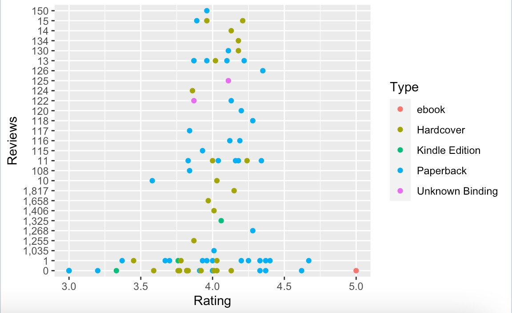

# R-Assignment 4

**Created by Sarida Buakaew (ID: 63130500112)**

Choose Dataset:
1. Top 270 Computer Science / Programing Books (Data from Thomas Konstantin, [Kaggle](https://www.kaggle.com/thomaskonstantin/top-270-rated-computer-science-programing-books)) >> [Using CSV](https://raw.githubusercontent.com/safesit23/INT214-Statistics/main/datasets/prog_book.csv)

2. Superstore Sales Dataset (Data from Rohit Sahoo,[Kaggle](https://www.kaggle.com/rohitsahoo/sales-forecasting)) >> [Using CSV](https://raw.githubusercontent.com/safesit23/INT214-Statistics/main/datasets/superstore_sales.csv)


### Outlines
1. Explore the dataset
2. Learning function from Tidyverse
3. Transform data with dplyr and finding insight the data
4. Visualization with GGplot2

## Part 1: Explore the dataset

```
# Library
library(dplyr)
library(stringr)
library(readr)
library(ggplot2)
book <- read.csv("https://raw.githubusercontent.com/safesit23/INT214-Statistics/main/datasets/prog_book.csv")
```
In this dataset has

```
Rows: 271
Columns: 7
$ Rating          <dbl> 4.17, 4.01, 3.33, 3.97, 4.06, 3.84, 4.09, 4.15, 3.87, 4.62, 4.03, 3.78, 3.73, 3.87, 3.87, 3.95, 3.85, 3.94, 3.75, ~
$ Reviews         <chr> "3,829", "1,406", "0", "1,658", "1,325", "117", "5,938", "1,817", "2,093", "0", "160", "481", "33", "1,255", "593"~
$ Book_title      <chr> "The Elements of Style", "The Information: A History, a Theory, a Flood", "Responsive Web Design Overview For Begi~
$ Description     <chr> "This style manual offers practical advice on improving writing skills. Throughout, the emphasis is on promoting a~
$ Number_Of_Pages <int> 105, 527, 50, 393, 305, 288, 256, 368, 259, 128, 352, 352, 200, 328, 240, 288, 392, 304, 336, 542, 192, 242, 224, ~
$ Type            <chr> "Hardcover", "Hardcover", "Kindle Edition", "Hardcover", "Kindle Edition", "Paperback", "Hardcover", "Hardcover", ~
$ Price           <dbl> 9.323529, 11.000000, 11.267647, 12.873529, 13.164706, 14.188235, 14.232353, 14.364706, 14.502941, 14.641176, 15.22~
```
1.เช็คว่ามีค่า null ในตัว dataset ไหม

```
is.na(book)
```
ไม่มีข้อมูลใน dataset ที่เป็น null

2.สำรวจข้อมูลเบื้องต้น

```
summary(book)
```
```
     Rating        Reviews           Book_title        Description        Number_Of_Pages      Type               Price        
 Min.   :3.000   Length:271         Length:271         Length:271         Min.   :  50.0   Length:271         Min.   :  9.324  
 1st Qu.:3.915   Class :character   Class :character   Class :character   1st Qu.: 289.0   Class :character   1st Qu.: 30.751  
 Median :4.100   Mode  :character   Mode  :character   Mode  :character   Median : 384.0   Mode  :character   Median : 46.318  
 Mean   :4.067                                                            Mean   : 475.1                      Mean   : 54.542  
 3rd Qu.:4.250                                                            3rd Qu.: 572.5                      3rd Qu.: 67.854  
 Max.   :5.000                                                            Max.   :3168.0                      Max.   :235.650  
 ```
 ## Part 2: Learning function from Tidyverse

- Function `filter()` It using for filter columns

```
starwars %>% 
  select(name,height) %>%
  filter(height > 20)
```
```
# A tibble: 81 x 2
   name               height
   <chr>               <int>
 1 Luke Skywalker        172
 2 C-3PO                 167
 3 R2-D2                  96
 4 Darth Vader           202
 5 Leia Organa           150
 6 Owen Lars             178
 7 Beru Whitesun lars    165
 8 R5-D4                  97
 9 Biggs Darklighter     183
10 Obi-Wan Kenobi        182
# ... with 71 more rows
```
## Part 3: Transform data with dplyr and finding insight the data

1.ชื่อหนังสือที่มียอดรีวิวมากกว่าเท่ากับ 800

```
book %>%
  filter(Reviews >= 800) %>%
  select(Reviews,Book_title) %>%
  arrange(Book_title)

```

Result: แสดงชื่อหนังสือและยอดรีวิวที่มียอดรีวิวตั้งแต่ 800

```
 Reviews                                                                 Book_title
1      875                     Clean Code: A Handbook of Agile Software Craftsmanship
2        9                        Computational Geometry: Algorithms and Applications
3        9                                             Data Structures and Algorithms
4       88                                                              Deep Learning
5       92       Essential Scrum: A Practical Guide to the Most Popular Agile Process
6        9                               Haskell: The Craft of Functional Programming
7        9                                     Introduction to Functional Programming
8       92                                               The C++ Programming Language
9       86 The Cosmic Landscape: String Theory and the Illusion of Intelligent Design
10      91                                                        The Society of Mind
```
2.หนังสือเล่มไหนมีจำนวนหน้าน้อยที่สุด

```
book %>% 
  filter(Number_Of_Pages == min(Number_Of_Pages)) %>% 
  select(Book_title,Number_Of_Pages)
```

Result: แสดงชื่อหนังสือและจำนวนหน้าของหนังสือที่มีจำนวนหน้าน้อยที่สุด
```
                                                Book_title Number_Of_Pages
1 Responsive Web Design Overview For Beginners              50
```
3.มีหนังสือประเภทอะไรบ้าง

```
book %>%
  distinct(Type)
```

Result: แสดงประเภทของหนังสือ

```
                   Type
1             Hardcover
2        Kindle Edition
3             Paperback
4                 ebook
5       Unknown Binding
6 Boxed Set - Hardcover
```
4.มีหนังสือกี่ประเภทโดยที่แต่ละประเภทมี่กี่จำนวน

```
book$Type %>%
  table()
```

Result: แสดงชื่อประเภทของหนังสือและจำนวนของชนิดหนังสือโดยที่แยกจำนวนของแต่ละประเภท

```
Boxed Set - Hardcover                 ebook             Hardcover        Kindle Edition             Paperback       Unknown Binding 
                    1                     7                    95                    10                   156                     2 
```

5.แสดงจำนวนหน้าหนังสือและราคาของหนังสือที่มีราคามากกว่า 150 

```
book %>% 
  filter(Price > 150) %>%
  select(Number_Of_Pages,Price)
```

Result: แสดงจำนวนหน้าของหนังสือที่มีราคามากกว่า 150 

```
  Number_Of_Pages    Price
1            1235 176.1441
2             752 203.1088
3            1040 212.0971
4             896 220.3853
5            3168 220.3853
6             789 235.6500
```

6.หาราคาสูงสุด ราคาต่ำสุด และราคาเฉลี่ยของหนังสือ

```
book$Price %>% max()
book$Price %>% min()
book$Price %>% mean()
```

Result: แสดงค่าสูงสุดของหนังสือ
        แสดงค่าต่ำสุดของหนังสือ
        แสดงค่าเฉลี่ยของหนังสือ

```
> book$Price %>% max()
[1] 235.65
> book$Price %>% min()
[1] 9.323529
> book$Price %>% mean()
[1] 54.54186
```

## Part 4: Visualization with GGplot2
### 1.) Graph relation between Rating and Reviews

```
 scat_plot0 <- book %>% 
 filter(Reviews <= 1500 ) %>% 
 ggplot(aes(x=Rating,y=Reviews)) + geom_point(aes(color=Type))
 scat_plot0
```
Result:



### 2.) The chart shows the number of types.

```
 bar <- book %>% 
 ggplot(aes(x=Type)) + geom_bar(aes(color=Type))
 bar
```
Result:


