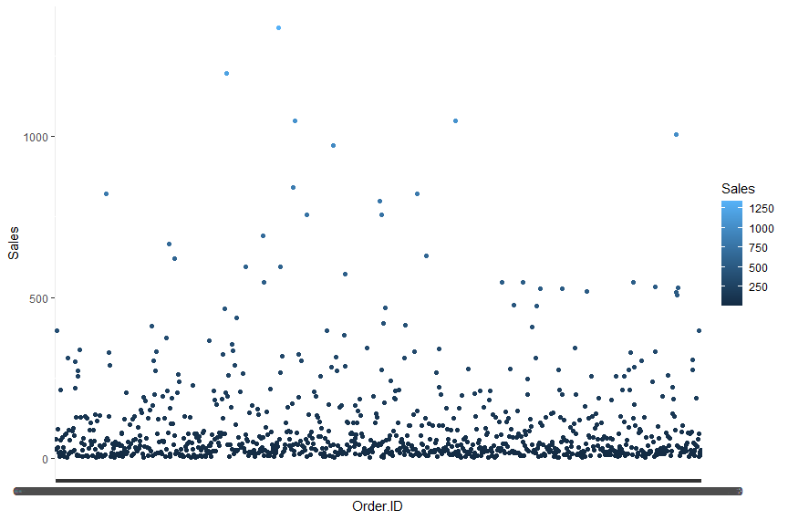

# R-Assignment 4

**Created by สุทธิพงษ์ ชนะมูล (ID: 63130500121)**

Choose Dataset: Superstore Sales Dataset (Data from Rohit Sahoo,[Kaggle](https://www.kaggle.com/rohitsahoo/sales-forecasting)) >> [Using CSV](https://raw.githubusercontent.com/safesit23/INT214-Statistics/main/datasets/superstore_sales.csv)


### Outlines
1. Explore the dataset
2. Learning function from Tidyverse
3. Transform data with dplyr and finding insight the data
4. Visualization with GGplot2

## Part 1: Explore the dataset

```
# Library dplyr 
library(dplyr)

# Library lubridate : identify the order in which the year, month, and day appears in your dates.
install.packages("lubridate")
library(lubridate)

# Library ggplot2 : system for declaratively creating graphics
install.packages("ggplot2")
library(ggplot2)

# Dataset
superstore <- read_csv("https://raw.githubusercontent.com/safesit23/INT214-Statistics/main/datasets/superstore_sales.csv")

# Show Data
glimpse(superstore)
```

## Dataset

```
superstore <- read_csv("https://raw.githubusercontent.com/safesit23/INT214-Statistics/main/datasets/superstore_sales.csv")
```

## View Dataset

```
glimpse(superstore)
```
This Dataset is 18 columns ( Row.ID , Order.ID , Order.Date , Ship.Date , Ship.Mode , Customer.ID , Customer.Name , Segment , Country , City , State , Postal.Code , Region , Product.ID , Category , Sub.Category , Product.Name , Sales )
```
Rows: 9,800
Columns: 18
$ Row.ID        <int> 1, 2, 3, 4, 5, 6, 7, 8, 9, 10, 11, 12, 13, 14, 15, 16, 17, 18, 19, 20, 21, 22, 23, 24, 25, 26, 27~
$ Order.ID      <chr> "CA-2017-152156", "CA-2017-152156", "CA-2017-138688", "US-2016-108966", "US-2016-108966", "CA-201~
$ Order.Date    <chr> "08/11/2017", "08/11/2017", "12/06/2017", "11/10/2016", "11/10/2016", "09/06/2015", "09/06/2015",~
$ Ship.Date     <chr> "11/11/2017", "11/11/2017", "16/06/2017", "18/10/2016", "18/10/2016", "14/06/2015", "14/06/2015",~
$ Ship.Mode     <chr> "Second Class", "Second Class", "Second Class", "Standard Class", "Standard Class", "Standard Cla~
$ Customer.ID   <chr> "CG-12520", "CG-12520", "DV-13045", "SO-20335", "SO-20335", "BH-11710", "BH-11710", "BH-11710", "~
$ Customer.Name <chr> "Claire Gute", "Claire Gute", "Darrin Van Huff", "Sean O'Donnell", "Sean O'Donnell", "Brosina Hof~
$ Segment       <chr> "Consumer", "Consumer", "Corporate", "Consumer", "Consumer", "Consumer", "Consumer", "Consumer", ~
$ Country       <chr> "United States", "United States", "United States", "United States", "United States", "United Stat~
$ City          <chr> "Henderson", "Henderson", "Los Angeles", "Fort Lauderdale", "Fort Lauderdale", "Los Angeles", "Lo~
$ State         <chr> "Kentucky", "Kentucky", "California", "Florida", "Florida", "California", "California", "Californ~
$ Postal.Code   <int> 42420, 42420, 90036, 33311, 33311, 90032, 90032, 90032, 90032, 90032, 90032, 90032, 28027, 98103,~
$ Region        <chr> "South", "South", "West", "South", "South", "West", "West", "West", "West", "West", "West", "West~
$ Product.ID    <chr> "FUR-BO-10001798", "FUR-CH-10000454", "OFF-LA-10000240", "FUR-TA-10000577", "OFF-ST-10000760", "F~
$ Category      <chr> "Furniture", "Furniture", "Office Supplies", "Furniture", "Office Supplies", "Furniture", "Office~
$ Sub.Category  <chr> "Bookcases", "Chairs", "Labels", "Tables", "Storage", "Furnishings", "Art", "Phones", "Binders", ~
$ Product.Name  <chr> "Bush Somerset Collection Bookcase", "Hon Deluxe Fabric Upholstered Stacking Chairs, Rounded Back~
$ Sales         <dbl> 261.9600, 731.9400, 14.6200, 957.5775, 22.3680, 48.8600, 7.2800, 907.1520, 18.5040, 114.9000, 170~
```


## Part 2: Learning function from Tidyverse

- ฟังก์ชัน dim() (ย่อมาจาก "dimention") เป็นFunctionที่บอกเราว่าข้อมูลเรามีกี่แถว (rows หรือ observations) และมีกี่คอลัมน์ (ตัวแปร) 

```
dim(superstore)
```
Result :

```
[1] 9800   18
```
## Part 3: Transform data with dplyr and finding insight the data

//1.หมวดหมู่สินค้าที่ขายได้มากที่สุด 5 อันดับแรก

```
Top5Supst <- superstore %>% select(`Sub-Category`) %>% count(`Sub-Category`) %>% arrange(desc(n)) %>% slice(1:5)
as_tibble(Top5Supst)
```

Result:

```
 `Sub-Category`     n
  <chr>          <int>
1 Binders         1492
2 Paper           1338
3 Furnishings      931
4 Phones           876
5 Storage          832
```
//Explain

- list 1
- list 2

## Part 4: Visualization with GGplot2
### 1.) Graph show relation between height and mass
```
scat_plot <- starwars %>% filter(mass<500) %>% ggplot(aes(x=height,y=mass))+
  geom_point(aes(color=gender))

scat_plot+geom_smooth()
```
Result:



**Guideline:
Embed Image by using this syntax in markdown file
````

````
